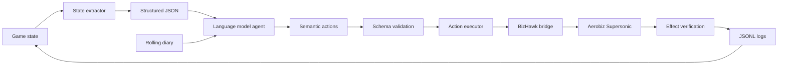

# Aerobiz Evals

## A benchmark for long-horizon strategic reasoning in AI agents

Aerobiz Evals is an experimental environment for studying whether language-model agents can manage a business consistently over a long decision horizon.

The environment uses **Aerobiz Supersonic**, a turn-based airline management simulation. The agent acts as the CEO of an airline and must decide how to use limited capital, negotiate airport slots, buy aircraft, open routes, establish regional hubs, adjust prices, respond to competitors, and adapt to economic events.

The project is not primarily about making an AI play a video game. It uses the game as a compact testbed for strategic planning, economic reasoning, memory, adaptation, and reliable tool use.

## Core idea

Each game turn represents one quarter. A full game can span up to 20 simulated years, creating a long sequence of interdependent decisions.

At each turn, the agent receives:

- a structured summary of the current company state;
- recent financial and operational results;
- information about routes, aircraft, slots, negotiations, rivals, and events;
- a rolling diary containing its previous decisions and plans.

The agent returns high-level actions in JSON. For example:

```json
{
  "diary_update": "Reserve capacity for the next expansion cycle while waiting for the European slot negotiation.",
  "actions": [
    {
      "action": "negotiate_slots",
      "params": {"city": "EU11", "slots": 2}
    },
    {
      "action": "buy_aircraft",
      "params": {"model": "A340", "qty": 1}
    }
  ]
}
```

The harness validates the JSON, translates semantic actions into controller inputs, executes them in BizHawk, and checks whether the expected effect actually occurred in the game.

## What the evaluation studies

Aerobiz is designed to expose capabilities that are difficult to measure in short question-answering tasks:

- **Long-horizon planning:** can the agent make decisions whose payoff appears several turns later?
- **Capital allocation:** can it balance fleet investment, route expansion, operating costs, and liquidity?
- **Network strategy:** can it build a profitable route network instead of choosing isolated local actions?
- **Memory:** can it track negotiations, commitments, previous failures, and strategic goals?
- **Economic reasoning:** can it connect demand, fares, capacity, competition, and profit?
- **Adaptation:** can it change its plan after a war, oil crisis, Olympics, or poor financial result?
- **Competition:** can it respond to rival airlines while maintaining a long-term objective?
- **Reliable execution:** can it produce valid actions and operate the environment without silent failures?
- **Self-correction:** can it recognize that an action failed or that an assumption was wrong?

## The game

Aerobiz Supersonic is a turn-based airline management simulation
for the SNES, published by Koei. Each turn is one financial quarter, and a full scenario runs up
to 80 quarters — twenty simulated years. Four airlines, one of them the player,
compete over the same world map.

The map holds **89 cities across 7 regions** (North America, South America,
Europe, Africa, the Middle East, Southeast Asia, Oceania). Nothing about the
map is free to use: to fly anywhere, an airline first has to obtain landing
**slots** at a city, and slots come from a negotiation that takes several
quarters and occupies one of the company's few negotiators. A city can refuse.
Its slot ceiling varies — some cities cap at 2, others allow far more — and
that ceiling is a property of the city, not a global rule.

The main levers, with the costs this project measured in-game rather than read
from a manual:

| Lever | What it does | Measured cost |
|---|---|---|
| Negotiate slots | Buys the right to land in a city; takes quarters, ties up a negotiator | varies by city |
| Open route | Connects a hub the airline owns to a city where it holds slots; sets weekly frequency and one of three fare levels | operating cost per quarter |
| Buy aircraft | Orders from a catalog of 8 models differing in price, range, seats and running cost; up to 10 per order | e.g. ~$28,800K for a MD100 |
| Open regional hub | Establishes a second base in another region, unlocking routes that do not start at headquarters | $28,800K plus one negotiator; not ready the same quarter |
| Business venture | Buys a facility in a city (hotel, concert hall, and so on) to raise its attractiveness | e.g. $144,000K, months to complete |
| Ad campaign | Raises demand on the airline's network | ~$1,800K |

Two properties make this hard for an agent, and they are the reason the game
was chosen:

**Nothing pays off immediately.** An aircraft ordered this quarter arrives in
about three months. A hub started this quarter is not usable this quarter. A
venture debits the cash now and counts later. An agent that only optimizes the
current screen will spend everything and stall.

**Winning is not one number.** The victory condition is compound: hold a hub in
every region, lead passenger traffic in most of them, and run an annual profit.
An airline can be rich and losing, or expanding fast and going bankrupt. There
is no single quantity to hill-climb.

Random events — oil shocks, wars, the Olympics — periodically invalidate a plan
that was reasonable when it was made, which is what turns the run into a test of
adaptation rather than of a fixed opening strategy.

## Why Aerobiz?

Aerobiz combines several properties that are useful for agent evaluation:

- decisions happen in discrete turns rather than real time;
- a game can last up to 80 quarterly turns;
- four airlines compete for passengers, routes, and airport capacity;
- negotiations and investments have delayed outcomes;
- aircraft have different prices, capacities, operating costs, and ranges;
- events can invalidate a previously reasonable plan;
- success is multi-objective: growth, regional coverage, passenger share, and profit all matter.

This makes the environment closer to a small strategic business simulation than to a reflex-based game.

## What makes Aerobiz different?

The important distinction is not the theme of the environment. It is the difference between:

1. **What the environment asks the agent to do:** the observable task, actions, and feedback loop.
2. **What the evaluation tries to measure:** the underlying capability inferred from that task.

Aerobiz uses an airline simulator as an instrument. The target capability is not knowledge of aviation. It is the ability to operate a competitive business network while preserving a coherent strategy over delayed, uncertain, and interdependent decisions.

| Benchmark | What the agent does | Main capability measured | Structural change introduced by Aerobiz |
|---|---|---|---|
| Vending-Bench | Manages inventory, suppliers, prices, fees, and customer sales over a long simulation | Long-term coherence and business survival | Changes the problem from managing one business operation to coordinating a competitive, geographically distributed network. The measured capability expands from maintaining coherence to planning expansion, managing interdependent resources, and responding to rivals. |
| Vending-Bench Arena | Runs a business while competing with other business-managing agents at the same location | Competitive interaction added to long-horizon business management | Changes competition from a local interaction, such as price wars and supplier choices, into competition over a spatial market. Agents must sequence airport negotiations, routes, hubs, fleet range, and passenger share. |
| RetailBench | Operates a supermarket by choosing prices, suppliers, inventory, and assortment | Strategy stability, evidence gathering, and long-horizon operational decision-making | Changes the unit of control from a single retail node to a multi-node network. The evaluation moves from stable store operations and replenishment decisions to system-level network design, delayed infrastructure, regional expansion, and rival response. |
| Factorio Learning Environment | Builds factories, automates production, and allocates resources | Resource optimization, planning, program synthesis, and spatial reasoning | Changes the objective from optimizing a production system to operating a viable business in a market. The measured capability moves from throughput, automation, and spatial construction to capital allocation, demand, pricing, profit, competition, and adaptation. |
| lmgame-Bench | Plays a standardized suite of platformer, puzzle, and narrative games | General game-playing abilities, with perception and memory scaffolds | Uses a specialized business environment to measure strategy and economic outcomes instead of broad game competence |
| VideoGameBench | Interacts with games from raw visual input, often in real time | Visual perception, navigation, memory, and computer-use performance | Makes a structural change in the control interface and time model: from raw visual actions in real time to semantic business actions in discrete turns. This reduces reflex, timing, and low-level navigation confounds so the main track can measure strategic decision-making. |

These are structural changes, not merely changes of theme. They modify the state space, the dependency between actions, the time at which rewards appear, the source of uncertainty, and the meaning of success. As a result, the target capability changes as well.

The abstract contribution of Aerobiz is the combination of five properties in one evaluation target:

- **long-horizon coherence:** decisions remain connected across many turns;
- **competitive strategy:** the agent must optimize while rivals change the environment;
- **network reasoning:** value depends on relationships between routes, cities, hubs, and fleet assets;
- **economic adaptation:** the agent must balance growth, liquidity, demand, cost, and risk;
- **verified agency:** the evaluation distinguishes a proposed action, an executable action, and an action that produced the intended effect.

This makes Aerobiz complementary to the other benchmarks. It does not claim to measure general intelligence. It measures a narrower capability: **reliable long-horizon strategic reasoning in a competitive, economically constrained environment**.

## Semantic action interface

The main evaluation uses semantic actions instead of raw button presses. The model decides:

```text
negotiate_slots(city="EU11", slots=2)
buy_aircraft(model="A340", qty=1)
open_route(to="EU11", flights_week=2, fare_level="mid")
adjust_route(route="Washington-Havana", fare_level="high")
```

The harness performs the low-level navigation required by the game.

This separation is intentional. A raw screenshot-and-controller benchmark mixes strategy with visual navigation, timing, and input handling. The semantic track aims to measure business strategy first. A raw UI track could be added later to study computer-use capabilities separately.

## System architecture



Main components:

| Component | Purpose |
|---|---|
| BizHawk | Runs the game and provides screenshots, inputs, savestates, and memory access |
| Lua/Python bridge | Connects the emulator to the Python harness |
| State extractor | Builds the structured observation supplied to the agent |
| `schema.py` | Defines actions and validates their parameters |
| `agent.py` | Runs the model decision loop, diary, and turn logs |
| `executor.py` | Converts semantic actions into game navigation macros |
| `baselines.py` | Provides non-LLM reference policies |
| `compare.py` | Summarizes runs and detects model-fallback contamination |
| `logs/` | Stores states, screenshots, actions, results, and costs |

## Action verification

A valid model response is not automatically a successful action.

For example, an `open_route` command only counts as successful if the route appears and the expected financial effect is observed. The harness checks effects such as:

- cash debited or credited;
- staff becoming busy or available;
- a route appearing in the route table;
- aircraft being added to the fleet;
- slot counts changing;
- route fares and frequencies persisting after confirmation;
- hubs or ventures reaching the expected state.

This prevents the evaluation from confusing "the macro ran" with "the game accepted the decision".

The currently audited semantic actions include:

```text
wait
negotiate_slots
return_slots
open_route
buy_aircraft
open_hub
close_hub
adjust_route
open_venture
ad_campaign
```

Some game actions remain outside the official evaluation set until they are calibrated and verified again.

## How the evaluation is run

A run is one game: one player, one savestate, a fixed number of quarters. The
loop is the same whether the player is a language model or a scripted baseline,
which is what makes the two comparable.

Each turn does the following:

1. **Read the game.** The harness screenshots the emulator and reads the state
   back out of the pixels — cash, fleet, routes, slots, pending negotiations,
   budgets, the victory board. Reading is by glyph-hash OCR against an atlas
   measured from the game itself; an unrecognized glyph produces `None`, never
   a guessed digit.
2. **Build the observation.** The state becomes a JSON object, together with the
   player's own rolling diary from previous turns. Fields that could not be read
   say so explicitly (`"nao lido neste turno"`) rather than defaulting to zero.
3. **Ask for actions.** The player returns JSON: a diary update and up to 8
   actions. It may first request statistics for up to 5 cities and decide with
   them in the same quarter; how many cities a player inspects before acting is
   itself recorded.
4. **Validate.** Actions are checked against the action schema before any
   emulator time is spent. Invalid actions are returned to the player with the
   reason, and counted.
5. **Execute and verify.** Each valid action is translated into controller
   inputs. Crucially, the harness then checks the game for the *effect* — cash
   falling by the exact expected amount, a staff bar moving, a counter changing.
   An action is recorded as successful only if the game changed.
6. **End the quarter** and record everything: one JSONL line per action with
   cash before and after, one per turn, plus screenshots.

### How players are compared

Every run — model or baseline — uses the identical savestate, executor, action
schema, observation format and termination rule. Only the player differs.

The headline metric is the **substantive effect rate**: of the actions that
actually reached the game, what fraction produced a verified effect, with `wait`
excluded from the count. Excluding `wait` is not cosmetic. It was measured that
counting it as an effect gave the random baseline 100% against the greedy
baseline's 66% — the most passive player won the scoreboard. Alongside it the
run records goal progress (hubs held, regions entered, the quarter of first
expansion), the cash curve, and execution reliability (validation errors, JSON
repair attempts, turns lost to a fallback model).

Two guards keep a comparison honest:

- **Fallback contamination.** Logs record `model_solicitado` and
  `model_respondeu` separately. If a provider silently served a different model,
  those turns are visible instead of being attributed to the requested one.
- **A floor, not just a ceiling.** Two non-LLM baselines run through the exact
  same path. A model that cannot beat a random legal player is not doing
  strategy, and without the floor that would be invisible.

### What has been measured so far

Runs completed to date, at the 12-quarter horizon and shorter:

| Player | Runs | Longest run | Substantive effect rate |
|---|---|---|---|
| `greedy` baseline | 6 | 12 quarters | 44-67% |
| `random` baseline | 9 | 12 quarters | 58-100% |
| LLM (`laguna-s-2.1-free`) | 3 | 2 quarters | not yet measurable |

These establish that the harness executes and verifies actions end to end. The
multi-seed, multi-model comparison at the full 80-quarter horizon has not been
run, so no ranking between models exists yet.

## How to measure the result

The evaluation should report a **vector of metrics**, rather than immediately reducing performance to a single number. A single score can hide important differences between a profitable but unreliable agent and a reliable agent with a weak strategy.

### 1. Strategic and economic performance

These metrics measure what the airline achieved:

| Metric | What it measures |
|---|---|
| Final net worth | Overall economic result at the end of the run |
| Final cash | Liquidity and financial resilience |
| Cumulative profit | Profit generated across the full horizon |
| Annual profit | Whether the company remains economically sustainable |
| Passenger share | Competitive performance by region |
| Profitable routes | Quality and sustainability of the network |
| Regional hubs | Progress toward geographic expansion |
| Time to subgoal | How quickly the agent reaches an achievable objective |
| Bankruptcy | Whether the strategy survives the full horizon |
| Victory status | Whether the game’s compound victory condition was reached |

The primary leaderboard should initially show these metrics separately. An optional normalized composite score can be added only after the scenario, objectives, and reachable state are validated.

### 2. Execution reliability

These metrics separate strategic quality from infrastructure and formatting failures:

- valid JSON rate;
- structurally valid action rate;
- successful execution rate;
- legitimate game rejection rate;
- executor failure rate;
- invalid actions per turn;
- JSON repair attempts;
- decision latency;
- token usage and cost per run;
- number of turns contaminated by model fallback.

### 3. Long-horizon behavior

The trajectory should be analyzed, not just the final screen. Useful behavioral measures include:

- whether the agent starts negotiations early enough for delayed delivery;
- whether it preserves cash for known future commitments;
- whether it changes price or frequency after demand changes;
- whether it reacts to economic shocks within a defined number of turns;
- whether it repeats an action that previously failed;
- whether it updates its plan when the environment makes an objective unreachable;
- whether its diary preserves causal explanations instead of merely describing events.

## Evaluation protocol

For each model, a run should use the same:

- game scenario and difficulty;
- initial savestate;
- action schema and system prompt;
- emulator and harness versions;
- observation format;
- randomization procedure;
- termination rules.

At least five independent seeds per model are recommended for an initial comparison. More runs are required when the environment has high variance because of negotiation timing, random events, or rival behavior.

Fallback models must be disabled during the official comparison. The logs record both:

- `model_solicitado`: the model requested by the experiment;
- `model_respondeu`: the model that actually generated the response.

If these values differ, the turn is marked as contaminated and must not be silently attributed to the requested model.

Results should include confidence intervals, preferably using bootstrap resampling for continuous metrics such as final cash, net worth, and cumulative profit.

## Baselines

The project includes two simple non-LLM baselines using the same action interface:

### Random legal baseline

Selects random actions that satisfy the structural constraints. It provides a lower bound for the environment and tests whether the executor is robust.

### Greedy baseline

Uses simple rules such as opening a route when an aircraft and slots are available, negotiating for additional cities when capacity exists, and adjusting fares based on observed load. When none of its rules fire it emits **no action at all** and records the measured blocker in the diary — it never pads the turn with `wait`, because that would hide the finding the baseline exists to expose.

### Running them

Both baselines go through the same path as an LLM player — same savestate, same `Executor`, same `turns.jsonl`, same telemetry, same `resumo.json`:

```bash
python run_eval.py --model greedy --city NA13 --turns 3 --seed 0
python run_eval.py --model random --city NA13 --turns 3 --seed 0
```

`resumo.json` carries `tipo_de_jogador`, `baseline` and `baseline_seed`, so a baseline run is never mistaken for a model run. `python test_baselines_offline.py` replays both policies against real recorded states and fails if either emits a parameter the current action space rejects.

Future versions can add a privileged policy with access to the full simulator state, human baselines, and ablation studies for the diary, RAM extraction, and rival information.

## Current configuration

The current single-player setup uses:

| Setting | Value |
|---|---|
| Scenario | Supersonic Travel, 2000-2020 |
| Difficulty | Level 5, maximum |
| Player airline | Federal |
| Base | Washington |
| Rivals | MetLink/New York, AirRoma/Rome, and Aussie/Sydney |
| Initial cash | 1,220,000K |
| Horizon | Up to 80 quarterly turns |

The multiplayer version is planned as a separate track in which up to four agents control different airlines in the same game.

## Reproducibility and ROM policy

The project is currently Windows-oriented and uses BizHawk, Python, and a legally obtained copy of Aerobiz Supersonic.

The repository should distribute the harness, schemas, documentation, logs, and reproducibility information, but not commercial ROM files or proprietary assets. Users are responsible for obtaining any required game files legally.

## Repository structure

```text
aerobiz-evals/
├── harness/                    # The whole system: emulator bridge, agent loop,
│   │                           # action executor, screen readers, baselines
│   ├── bridge.py / bridge.lua  # IPC with BizHawk (Lua side + Python side)
│   ├── world.py                # Screen reading: OCR by glyph hash, region masks
│   ├── executor.py             # Semantic action -> controller inputs -> effect check
│   ├── pilot.py                # Turn loop, state building, telemetry
│   ├── agent.py                # LLM client and turn contract
│   ├── baselines.py            # Non-LLM players (random / greedy) used as a floor
│   ├── schema.py               # Action space and validation
│   ├── obs.py                  # Optional Logfire telemetry (off without credentials)
│   ├── run_eval.py             # Runner: one game -> resumo.json
│   ├── test_harness.py         # Test suite (`--offline` runs with no emulator)
│   └── *.json                  # Calibration data: glyph atlas, region masks, city stats
├── logs/                       # Screenshot fixtures the offline suite reads
├── roms/                       # Setup instructions only; no ROM is distributed
├── .github/workflows/          # CI: secret scan, binary/ROM guard, syntax check
├── ACTION_SPACE.md             # Detailed action inventory
├── AUDITORIA_ACOES.md          # Effect-based action audit
├── CALIBRATION.md              # Measured navigation and in-game values
├── VIABILIDADE.md              # Research thesis and feasibility analysis
├── STATUS.md                   # Running work log
├── SECURITY.md                 # Reporting policy and what this runs on your machine
└── NOTICE.md                   # Copyright and third-party notices
```

## Quickstart

The offline test suite needs **no emulator and no ROM** — it reads the
screenshot fixtures committed under `logs/`. It is the fastest way to confirm a
clone is intact:

```bash
git clone https://github.com/joaovpfarias/aerobiz-evals.git
cd aerobiz-evals
pip install -r requirements.txt
python harness/test_harness.py --offline     # expect: 19 tests, 0 failures
```

To actually run a game you additionally need Windows, BizHawk, your own legally
obtained ROM in `roms/`, and a savestate in `states/` — see `SETUP_EVAL.md`.

```bash
python harness/run_eval.py --model greedy --city NA13 --turns 12 --seed 0
```

Telemetry is optional and off by default: `harness/obs.py` sends nothing unless
a local `.logfire/logfire_credentials.json` exists (never committed). Set
`AEROBIZ_LOGFIRE_PROJETO="youraccount/yourproject"` to pin the destination
project, so a credential from another project is refused instead of used.

## Related work

- [Vending-Bench](https://arxiv.org/abs/2502.15840) - long-term coherence in autonomous business management.
- [Vending-Bench 2](https://andonlabs.com/evals/vending-bench-2) - long-horizon business management with an optional competitive arena.
- [RetailBench](https://arxiv.org/abs/2603.16453) - long-horizon retail decisions, strategy stability, and comparison with an oracle policy.
- [Factorio Learning Environment](https://arxiv.org/abs/2503.09617) - structured and open-ended resource optimization tasks.
- [lmgame-Bench](https://arxiv.org/abs/2505.15146) - standardized game environments with perception and memory considerations.
- [VideoGameBench](https://arxiv.org/abs/2505.18134) - visual game completion and the effect of real-time latency.

## Disclaimer

Aerobiz Evals is an experimental research project. A result from one run is not a general measure of intelligence, business ability, or model safety.
