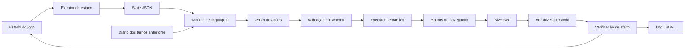

# Aerobiz Evals

## Avaliando raciocínio estratégico de longo horizonte em agentes de IA

> **Status:** protótipo de pesquisa em andamento. O harness, a ponte com o emulador e um subconjunto amplo de ações já foram implementados e auditados. O leaderboard final ainda não foi publicado.

Aerobiz Evals é um ambiente experimental para avaliar agentes baseados em modelos de linguagem em um problema de gestão empresarial competitiva e de longo horizonte.

O ambiente usa **Aerobiz Supersonic**, um simulador de companhias aéreas originalmente lançado para consoles da década de 1990. Em vez de pedir ao modelo que responda perguntas abstratas sobre estratégia, o projeto o coloca no papel de CEO de uma companhia aérea. A cada trimestre, o agente precisa decidir como alocar capital, negociar slots, abrir rotas, comprar aeronaves, criar hubs, ajustar preços, lidar com concorrentes e reagir a eventos econômicos.

O objetivo do projeto não é simplesmente fazer uma IA "jogar videogame". O objetivo é medir se um agente consegue manter uma política coerente de negócio durante muitos ciclos de decisão, com orçamento limitado, informação incompleta, payoffs atrasados, competição e eventos exógenos.

## Resumo rápido

O agente recebe um resumo estruturado do estado atual da companhia e um diário das decisões anteriores. Ele devolve uma lista de ações semânticas em JSON, por exemplo:

```json
{
  "diary_update": "Negociações foram iniciadas em duas cidades prioritárias. O caixa ainda permite comprar uma aeronave de maior alcance no próximo ciclo.",
  "actions": [
    {
      "action": "negotiate_slots",
      "params": {"city": "EU11", "slots": 2}
    },
    {
      "action": "buy_aircraft",
      "params": {"model": "A340", "qty": 1}
    }
  ]
}
```

O harness valida a resposta, traduz as ações em sequências de comandos do jogo, executa-as no BizHawk e verifica se o estado do jogo realmente mudou. Uma resposta JSON válida, sozinha, não conta como uma ação bem-sucedida.

## Por que este ambiente?

Benchmarks tradicionais de LLM normalmente medem tarefas curtas e bem delimitadas: responder uma pergunta, escrever código, classificar um exemplo ou completar uma sequência de ações. Essas avaliações são úteis, mas não capturam bem problemas em que o agente precisa:

- tomar decisões repetidas ao longo de meses ou anos simulados;
- lembrar compromissos e consequências de decisões anteriores;
- operar sob restrições de caixa, capacidade e recursos humanos;
- aceitar que uma ação pode levar vários turnos para produzir resultado;
- escolher entre crescimento, liquidez, risco e posição competitiva;
- reagir a eventos que tornam o plano anterior menos adequado;
- distinguir uma ação válida de uma ação que realmente produziu efeito;
- evitar que uma pequena falha de estado se transforme em uma estratégia incoerente.

Aerobiz é interessante porque transforma esses requisitos em um ambiente turn-based. Um turno equivale a um trimestre, e uma partida pode durar até 20 anos simulados. O agente não precisa competir contra reflexos humanos ou latência de tempo real. O problema central é decidir bem, manter coerência e aprender com o resultado.

## O que o jogo oferece como problema de decisão

Uma partida tem quatro companhias aéreas. A companhia controlada pelo agente concorre com três rivais controlados pelo jogo ou por outros agentes.

As decisões envolvem:

| Mecânica | Capacidade avaliada |
|---|---|
| Compra de aeronaves | Alocação de capital, alcance, capacidade e custo operacional |
| Negociação de slots | Planejamento com resultado atrasado e pipeline de ações |
| Abertura de rotas | Expansão de rede, custo de oportunidade e economia espacial |
| Voos e tarifas | Microeconomia, capacidade, demanda e preço |
| Hubs regionais | Sequenciamento de subobjetivos e expansão internacional |
| Empreendimentos locais | Investimento, maturação e ativação de demanda |
| Campanhas de anúncio | Gasto discricionário e geração de demanda |
| Relatórios trimestrais | Leitura de feedback e atribuição de resultado |
| Rivais | Estratégia competitiva e corrida por slots e passageiros |
| Guerra, petróleo e Olimpíadas | Adaptação a choques exógenos |
| Horizonte de até 80 turnos | Coerência de longo prazo e gestão de memória |

No cenário de avaliação configurado atualmente, a condição completa de vitória envolve estabelecer hubs em todas as regiões, liderar em passageiros nas regiões exigidas pela dificuldade e registrar lucro anual. A partida também pode terminar por falência.

## Hipótese de pesquisa

A hipótese principal é:

> Agentes de linguagem podem tomar decisões locais plausíveis, mas apresentam dificuldades para manter uma estratégia consistente quando as decisões têm efeitos atrasados, o ambiente muda, os recursos são limitados e os objetivos entram em conflito.

O benchmark foi desenhado para separar capacidades que frequentemente aparecem misturadas:

1. **Percepção:** o agente consegue extrair corretamente os dados exibidos nas telas?
2. **Memória:** ele lembra negociações, rotas, compromissos e aprendizados anteriores?
3. **Planejamento:** ele escolhe ações que fazem sentido para vários trimestres, e não apenas para o turno atual?
4. **Raciocínio econômico:** ele relaciona preço, demanda, capacidade, custos e caixa?
5. **Execução:** a ação decidida é válida e é executada corretamente no ambiente?
6. **Autocorreção:** ele percebe que a ação não funcionou ou que uma hipótese estava errada?
7. **Adaptação:** ele modifica o plano depois de eventos ou feedback adverso?
8. **Competição:** ele reage ao comportamento dos rivais sem perder o objetivo de longo prazo?

## Relação com outros benchmarks

O desenho do projeto foi comparado com benchmarks de agentes de longa duração e ambientes de jogos.

### Vending-Bench

Vending-Bench avalia a capacidade de um agente administrar uma máquina de venda automática durante um horizonte longo. O agente precisa comprar estoque, definir preços, pagar custos e manter o negócio funcionando. A métrica principal é o saldo financeiro ao final da simulação.

O Vending-Bench é a referência mais próxima para a dimensão de coerência temporal e gestão de negócio. Aerobiz adiciona:

- concorrência direta entre companhias;
- expansão geográfica e economia de rede;
- negociação de recursos com entrega atrasada;
- restrições de alcance e capacidade;
- choques históricos e macroeconômicos;
- objetivo composto, com lucro, participação e cobertura regional.

O Vending-Bench 2 também possui uma modalidade Arena com competição entre agentes. A diferença é que Aerobiz tem competição incorporada ao próprio simulador, junto com uma rede geográfica e decisões de frota.

### RetailBench

RetailBench modela a operação de um supermercado em uma simulação de horizonte longo. O agente escolhe preços, estoque, fornecedores e sortimento sob restrições de caixa e eventos externos. O trabalho também compara modelos com uma política privilegiada, analisa estabilidade de estratégia e observa se o agente sobrevive ao horizonte completo.

As lições relevantes para Aerobiz são:

- separar resultado final de análise comportamental;
- registrar se o agente sobreviveu ao horizonte;
- comparar contra uma política de referência, e não apenas contra outros LLMs;
- medir aquisição de evidência, consistência e estabilidade da política;
- não reduzir toda a avaliação a uma única pontuação.

### Factorio Learning Environment

O Factorio Learning Environment usa um ambiente de produção com desafios de escala crescente. Ele separa tarefas estruturadas, com recursos e objetivos definidos, de um modo aberto em que o agente tenta construir a maior fábrica possível.

Essa separação inspira duas trilhas para Aerobiz:

- **lab-play:** cenários curtos para testar uma capacidade isolada, como comprar um avião, abrir uma rota ou responder a uma restrição de alcance;
- **open-play:** uma partida completa, em que a estratégia não é fornecida e o agente precisa descobrir como atingir os objetivos.

### lmgame-Bench

lmgame-Bench mostra que simplesmente colocar um modelo diante de um jogo não produz necessariamente uma avaliação confiável. Percepção frágil, sensibilidade ao prompt e contaminação por conhecimento prévio podem dominar o resultado.

O projeto adota três princípios desse tipo de benchmark:

- interface padronizada para o ambiente;
- separação entre observação, decisão, execução e avaliação;
- possibilidade de usar scaffolds explícitos de memória e percepção.

Aerobiz não pretende esconder o diário ou a extração de estado. Pelo contrário, essas partes são componentes experimentais que devem ser registrados para que possamos dizer qual capacidade foi realmente medida.

### VideoGameBench

VideoGameBench avalia modelos de visão e linguagem em jogos populares usando entradas visuais brutas e interação em tempo real. O benchmark mostrou que latência de inferência pode ser um fator dominante. Por isso, também propôs uma modalidade em que o jogo pausa enquanto o modelo decide.

Aerobiz escolhe deliberadamente um ambiente turn-based e uma interface semântica. Isso reduz a interferência de reflexos, timing e navegação visual. A versão raw/UI pode ser uma extensão futura, mas não deve ser confundida com o benchmark estratégico principal.

## Decisão de design: interface semântica

Há duas formas de avaliar um agente em um jogo:

### Interface bruta

O modelo recebe screenshots e envia botões, como `Up`, `Down`, `Left`, `Right` e `A`.

Essa modalidade mede uma combinação de percepção visual, navegação, memória, timing e estratégia. Ela é interessante como teste de computer use, mas torna difícil atribuir a causa de uma falha.

### Interface semântica

O modelo recebe o estado do negócio e escolhe ações de alto nível, como:

```text
negotiate_slots(city="EU11", slots=2)
buy_aircraft(model="A340", qty=1)
open_route(to="EU11", flights_week=2, fare_level="mid")
```

O harness transforma a ação em comandos de controle e verifica o efeito no jogo.

Essa é a modalidade principal do Aerobiz Evals porque ela tenta medir estratégia, e não habilidade de localizar pixels. A interface bruta pode ser adicionada depois como uma trilha separada.

## Arquitetura



### Componentes

| Componente | Função |
|---|---|
| BizHawk | Executa o jogo e oferece screenshots, inputs, savestates e acesso à ponte Lua |
| `bridge.lua` | Lado do emulador da comunicação por arquivos |
| `bridge.py` | Cliente Python para screenshot, botões, savestates e leitura de memória |
| `cli.py` | Cockpit manual para o piloto F0 |
| `schema.py` | Define as ações semânticas e valida parâmetros |
| `agent.py` | Envia estado ao modelo, recebe ações, atualiza diário e grava `turns.jsonl` |
| `executor.py` | Traduz ações semânticas em sequências reais do jogo |
| `world.py` | Catálogo de cidades, regiões e dados da frota |
| `baselines.py` | Implementa baseline aleatória-legal e heurística gulosa |
| `compare.py` | Resume runs e detecta contaminação por fallback de modelo |
| `logs/` | Screenshots, estados e logs de execução |
| `states/` | Savestates reproduzíveis para iniciar uma partida no mesmo ponto |

## Ciclo de um turno

Cada turno segue estas etapas:

1. O jogo é colocado em um estado conhecido.
2. O extrator coleta informações das telas e, quando necessário, da RAM.
3. O estado é serializado em JSON.
4. O agente recebe o estado atual e as últimas entradas do seu diário.
5. O modelo devolve no máximo oito ações semânticas.
6. O schema verifica nome da ação, tipos, parâmetros, faixas e pré-condições conhecidas.
7. O executor realiza cada ação usando macros de navegação.
8. O harness verifica a tela de destino e o efeito econômico ou operacional.
9. O turno é registrado em JSONL.
10. O agente encerra o trimestre e o processo se repete.

O diário não é tratado apenas como uma conveniência de infraestrutura. Ele é parte do objeto de estudo: a qualidade das notas, a retenção de planos e a capacidade de corrigir uma hipótese também podem ser analisadas.

## Estado observado

O estado v0 segue uma estrutura semelhante a:

```json
{
  "date": {"year": 2000, "quarter": 1},
  "company": {
    "cash_k": 1220000,
    "planes": [],
    "slots": [],
    "routes": [],
    "negotiations": [],
    "hubs": [],
    "ventures": []
  },
  "rivals": [],
  "events": [],
  "report": {
    "revenue_k": 0,
    "cost_k": 0,
    "profit_k": 0,
    "passengers": 0
  },
  "last_turn_results": {}
}
```

O princípio é não fornecer ao modelo números que não foram observados. Quando um campo não está disponível ou ainda não foi calibrado, o agente deve tratá-lo como desconhecido, e o relatório deve registrar essa limitação.

## Espaço de ações

As ações abaixo foram implementadas e verificadas por meio de efeitos observáveis no jogo:

| Ação | Efeito principal | Verificação |
|---|---|---|
| `wait` | Passa o trimestre sem ação discricionária | Estado neutro |
| `negotiate_slots` | Inicia negociação de slots em uma cidade | Funcionário ocupado, custo e negociação visível |
| `return_slots` | Devolve slots negociados | Contagem de slots diminui |
| `open_route` | Abre uma rota entre cidades compatíveis | Débito de caixa e rota aparece na tabela |
| `buy_aircraft` | Compra aeronaves | Débito igual ao preço vezes quantidade |
| `open_hub` | Inicia preparação de hub regional | Débito, consumo de funcionário e estado do hub |
| `close_hub` | Fecha hub regional | Crédito de caixa, efeito cascata nas rotas e reabertura testada |
| `adjust_route` | Ajusta frequência e tarifa de uma rota | Valores persistem após sair e reabrir a tela |
| `open_venture` | Compra um empreendimento comercial em uma cidade | Débito, funcionário ocupado e maturação posterior |
| `ad_campaign` | Executa campanha pontual de anúncios | Débito conhecido e pré-requisitos verificados |

Algumas ações aparecem no inventário do jogo, mas permanecem fora do conjunto oficialmente suportado até nova calibração. Isso inclui os orçamentos recorrentes e certos fluxos de suspensão ou fechamento de rotas.

### Por que verificar efeito?

Um problema comum em automação de jogos é chamar uma macro que chega a uma tela parecida com a esperada, mas não confirma a ação. Se o harness contasse apenas a resposta do modelo ou a ausência de exceção, poderia registrar uma rota como aberta quando o caixa não mudou e nenhuma rota apareceu.

Por isso, a regra do projeto é:

> Uma ação só é sucesso quando o efeito esperado é observado no estado do jogo.

Exemplos:

- `open_route` precisa alterar o caixa e gerar uma rota visível;
- `buy_aircraft` precisa debitar o preço correto;
- `negotiate_slots` precisa alterar a disponibilidade de funcionários e o estado da negociação;
- `adjust_route` precisa persistir o novo valor depois da confirmação;
- `close_hub` precisa creditar o caixa e refletir o fechamento real, não apenas passar pelas telas de confirmação.

## Protocolo de avaliação proposto

Para uma comparação válida entre modelos, cada run deve registrar:

- cenário e dificuldade;
- savestate inicial e hash do arquivo;
- versão do BizHawk;
- versão do harness;
- modelo solicitado e modelo que realmente respondeu;
- prompt e schema utilizados;
- seed ou procedimento de randomização;
- número de turnos;
- uso de tokens, custo e latência;
- ações válidas, inválidas, recusadas e executadas;
- estado final e motivo de término.

### Regra de fallback

Fallback automático deve ficar desligado durante o eval. Se um turno solicitado ao modelo A for respondido pelo modelo B, a run fica contaminada para comparação de capacidade.

O log guarda `model_solicitado` e `model_respondeu` para que essa contaminação seja detectada. A comparação deve agrupar os resultados pelo modelo que efetivamente respondeu.

### Repetição

Uma única partida não é suficiente. O protocolo recomendado é:

- pelo menos cinco seeds por modelo para uma análise inicial;
- mais seeds quando a variância entre partidas for alta;
- mesmo savestate e mesmo protocolo para todos os modelos;
- baselines executadas no mesmo ambiente;
- intervalo de confiança por bootstrap para métricas contínuas;
- relatório separado para vitória, falência e runs interrompidas.

## Métricas

### Métricas de resultado

Estas métricas descrevem o desempenho econômico e estratégico:

| Métrica | Descrição |
|---|---|
| Patrimônio líquido final | Valor acumulado ao término da run |
| Caixa final | Liquidez disponível no último turno |
| Lucro acumulado | Soma dos resultados ao longo dos turnos |
| Lucro anual | Critério de sustentabilidade e parte da vitória |
| Passageiros por região | Participação competitiva da companhia |
| Número de rotas lucrativas | Qualidade da rede criada |
| Hubs conquistados | Progresso na expansão regional |
| Turnos até o objetivo | Velocidade de progresso, quando o objetivo é alcançável |
| Falência | Indicador binário de sobrevivência |
| Vitória | Critério composto do jogo, somente quando o estado inicial permite alcançá-la |

### Métricas de execução

Estas métricas ajudam a separar estratégia de confiabilidade operacional:

- taxa de JSON válido;
- taxa de ações estruturalmente válidas;
- taxa de ações executadas com sucesso;
- taxa de recusas legítimas do jogo;
- taxa de falhas do executor;
- número de ações inválidas por turno;
- número de tentativas de reparo de JSON;
- latência por decisão;
- tokens e custo por turno;
- número de turnos contaminados por fallback.

### Métricas comportamentais

O projeto também pode analisar a trajetória:

- o agente revisou uma rota depois de queda de ocupação?
- ele reprecificou depois de um choque de custo?
- ele manteve dinheiro suficiente para compromissos futuros?
- iniciou negociações cedo o suficiente para compensar o prazo?
- repetiu uma ação que já havia falhado?
- reconheceu que um objetivo era inalcançável a partir daquele estado?
- atualizou o diário com causa e efeito, ou apenas descreveu o turno?

## Baselines

Comparar apenas LLMs não mostra se o ambiente é realmente difícil. O harness inclui duas baselines não-LLM com a mesma interface:

### Baseline aleatória-legal

Escolhe ações aleatórias entre as opções estruturalmente válidas. Não possui estratégia, mas testa o piso do ambiente e a taxa de execução do executor.

### Baseline gulosa

Aplica regras simples, como abrir uma rota quando há avião e slots, iniciar negociações quando há capacidade e ajustar tarifas com base na ocupação observada.

Uma avaliação futura pode adicionar:

- uma política privilegiada que conhece o estado completo do simulador;
- uma política baseada em programação dinâmica para cenários pequenos;
- uma política humana casual;
- uma política humana especialista;
- ablação do diário;
- ablação da extração de RAM;
- ablação das informações dos rivais.

## Evidência inicial

Os primeiros smoke tests confirmaram que o pipeline consegue produzir efeitos reais no jogo, mas ainda não constituem um resultado comparativo final.

Em um teste de um turno iniciado a partir do mesmo savestate:

- `laguna-s-2.1-free` executou quatro negociações de slots e reduziu o caixa de `1.220.000K` para `1.218.180K`;
- `nemotron-3-ultra-free` executou quatro negociações e uma abertura de rota, reduzindo o caixa para `1.201.760K`;
- o débito da rota observado no segundo caso foi consistente com o valor previamente calibrado para aquela rota.

Esses dados demonstram integração e efeito observável. Eles não demonstram que um modelo é superior ao outro: são apenas smoke tests de um turno, com contraste de capacidade ainda não validado e sem análise de variância.

## Cenário atual

O setup canônico em desenvolvimento utiliza:

| Item | Configuração |
|---|---|
| Cenário | Supersonic Travel, 2000-2020 |
| Dificuldade | Nível 5, máxima |
| Companhia | Federal |
| Base | Washington |
| Rivais | MetLink/New York, AirRoma/Roma e Aussie/Sydney |
| Caixa inicial | 1.220.000K |
| Modo | Single-player |
| Horizonte | Até 80 turnos trimestrais |

O multiplayer está previsto como uma extensão em que até quatro modelos controlam companhias na mesma partida, cada um com diário separado.

## Estado atual do experimento

O projeto já possui:

- ponte BizHawk-Lua-Python;
- screenshots e leitura de dados do jogo;
- catálogo global de cidades e regiões;
- schema de ações semânticas;
- macros de navegação;
- savestates de referência;
- validação de parâmetros;
- verificação de efeitos reais;
- logs JSONL por turno;
- baselines não-LLM;
- auditoria individual das ações suportadas;
- suporte inicial a comparação entre modelos.

O experimento ainda não deve ser descrito como um leaderboard definitivo. Os principais pontos pendentes são:

1. completar runs longas com protocolo congelado;
2. repetir cada modelo em várias seeds;
3. medir o placar final em um estado inicial completamente alcançável;
4. caracterizar corretamente a escala entre regiões;
5. confirmar um contraste de capacidade entre os modelos comparados;
6. concluir o multiplayer;
7. revalidar as ações ainda fora do conjunto suportado;
8. publicar análise estatística com incerteza.

## Limitações conhecidas

### O contraste entre modelos ainda é nominal

O primeiro par de modelos foi escolhido com base em disponibilidade e nomes de variantes gratuitas. Isso não prova que um modelo seja realmente mais capaz que o outro. Uma diferença de resultado pode refletir estilo, latência, instabilidade do endpoint ou acaso.

### O savestate pode restringir a vitória global

Testes atuais indicam que, a partir do savestate de avaliação, algumas rotas intercontinentais podem permanecer fora do alcance mesmo após compra de aeronave de longo alcance. Enquanto essa escala não for caracterizada ou o savestate não for corrigido, a condição "hub em todas as regiões" não deve ser usada como único critério de comparação.

### O resultado mede o subconjunto de ações disponível

Em versões ou runs restritas, se frequência, tarifa, compra de aeronaves ou orçamento não estiverem disponíveis, a companhia pode ficar deficitária por construção. Nesse caso, o resultado mede confiabilidade, validação e uso das alavancas disponíveis, não a qualidade estratégica completa. O protocolo precisa registrar exatamente quais ações estavam habilitadas em cada run.

### Contaminação por conhecimento prévio

Aerobiz é um jogo conhecido e pode aparecer em dados de treinamento ou guias online. A proposta não assume que o agente nunca ouviu falar do jogo. O protocolo deve registrar essa limitação e distinguir conhecimento factual da execução de uma política coerente.

### ROM e direitos autorais

O repositório não deve distribuir ROMs ou assets proprietários. A reprodução deve usar uma cópia legalmente obtida pelo usuário, mantida fora do controle de versão. A recomendação é disponibilizar código, hashes, savestates quando juridicamente permitido e instruções de configuração, mas não o arquivo da ROM.

## Reprodutibilidade

### Dependências atuais

- Windows;
- BizHawk 2.11.1 ou versão compatível;
- Python 3;
- Anaconda ou outro ambiente Python equivalente;
- ROM legalmente obtida de Aerobiz Supersonic;
- acesso ao endpoint de modelo utilizado pelo agente;
- ferramentas locais do harness.

### Piloto manual

O piloto F0 existe para validar se o jogo é legível, se o diário se sustenta e se as decisões têm tensão suficiente antes de automatizar tudo.

```powershell
# A partir de experiments/aerobiz_evals/harness
python cli.py ping
python cli.py shot
python cli.py press Start
python cli.py seq "Down*3 A"
python cli.py save ..\states\t01.state
```

### Turno do agente

Com um estado extraído em JSON:

```powershell
python agent.py turn --state ..\logs\run_f0\state_t01.json --run ..\logs\run_f0
```

O resultado é impresso no terminal e registrado em `turns.jsonl`.

### Comparação de runs

```powershell
python compare.py ..\logs\eval_model_a ..\logs\eval_model_b
```

O comparador mostra turnos, caixa inicial e final, ações, rotas, cidades com slots, taxa de execução e possíveis turnos respondidos por um modelo diferente do solicitado.

## Estrutura do repositório

```text
experiments/aerobiz_evals/
├── harness/
│   ├── bridge.lua              # Ponte carregada no BizHawk
│   ├── bridge.py               # Cliente Python da ponte
│   ├── cli.py                  # Cockpit manual
│   ├── schema.py               # Action space e validação
│   ├── agent.py                # Loop de decisão do agente
│   ├── executor.py             # Macros e execução semântica
│   ├── world.py                # Cidades, regiões e frota
│   ├── baselines.py            # Baselines não-LLM
│   └── compare.py              # Comparação e alertas de contaminação
├── states/                     # Savestates de referência
├── logs/                       # Evidências, screenshots e JSONL
├── roms/                       # Instruções; ROM não deve ser distribuída
├── ACTION_SPACE.md             # Inventário detalhado das ações
├── AUDITORIA_ACOES.md          # Auditoria de efeitos
├── CALIBRATION.md              # Valores e navegação medidos
├── PLANO_EXECUCAO.md           # Roadmap operacional
├── RESULTADO_EVAL.md           # Resultados incrementais
└── VIABILIDADE.md              # Tese e análise de viabilidade
```

## Roadmap

### F0: piloto Wizard-of-Oz

Validar legibilidade, coerência e tensão do jogo com execução semi-manual.

### F1: harness semiautomático

Completar macros, extração de estado, savestate por turno, schema, logs e baselines.

### F2: avaliação controlada

Congelar cenário, prompt, schema, seeds e métricas. Executar múltiplos modelos e comparar resultados com intervalos de confiança.

### F3: extensões

- arena multiplayer com até quatro modelos;
- modo raw/UI para medir computer use;
- cenários diferentes;
- política privilegiada e baseline humana;
- análise de reação a eventos;
- leaderboard público;
- replay visual das partidas.

## Critérios para uma versão benchmark v1.0

Antes de apresentar o projeto como benchmark público, a versão v1.0 deve ter:

- protocolo pré-registrado e congelado;
- estado inicial em que os objetivos usados na pontuação sejam alcançáveis;
- ações suportadas com verificação de efeito;
- pelo menos uma baseline não-LLM forte o suficiente para servir de referência;
- múltiplas seeds por modelo;
- identificação inequívoca do modelo que respondeu;
- logs completos e reprodutíveis;
- regras claras para falha, timeout, JSON inválido e ação recusada;
- métricas contínuas além de vitória/falência;
- análise de variância e intervalos de confiança;
- documentação de ROM, direitos autorais e dependências;
- relatório explícito do que o benchmark mede e do que não mede.

## Referências e trabalhos relacionados

- [Vending-Bench: A Benchmark for Long-Term Coherence of Autonomous Agents](https://arxiv.org/abs/2502.15840)
- [Vending-Bench 2 - Andon Labs](https://andonlabs.com/evals/vending-bench-2)
- [RetailBench: Evaluating Long-Horizon Autonomous Decision-Making and Strategy Stability](https://arxiv.org/abs/2603.16453)
- [Factorio Learning Environment](https://arxiv.org/abs/2503.09617)
- [lmgame-Bench: How Good are LLMs at Playing Games?](https://arxiv.org/abs/2505.15146)
- [GamingAgent / lmgame-Bench repository](https://github.com/lmgame-org/GamingAgent)
- [VideoGameBench: Can Vision-Language Models complete popular video games?](https://arxiv.org/abs/2505.18134)

## Licença e aviso

Este projeto é uma pesquisa experimental sobre agentes de IA e tomada de decisão de longo horizonte. Resultados de uma run não devem ser interpretados como uma medida geral de inteligência, capacidade empresarial ou segurança de um modelo.

O repositório deve distribuir o harness e a documentação, mas não ROMs comerciais nem assets proprietários. Usuários são responsáveis por obter legalmente os arquivos necessários para reproduzir o ambiente.
